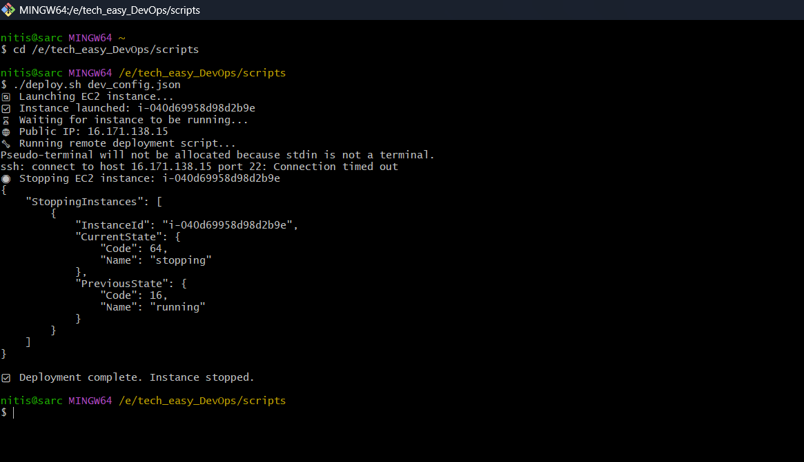
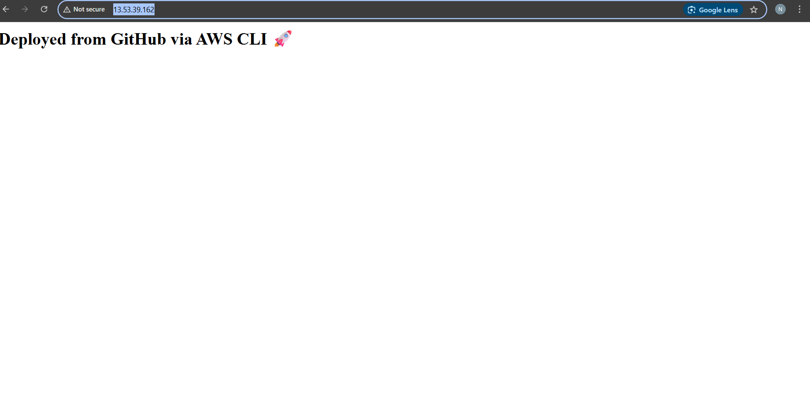

# TechEazy DevOps Assignment - AWS EC2 Auto Deployment 🚀

This project is automates the provisioning, deployment, and auto-shutdown of an EC2 instance using a Bash script and AWS CLI.

---

## ✅ Features

* Launches EC2 instance using configurable JSON
* Installs Git, Java, and HTTPD automatically
* Clones a GitHub repository containing the app
* Starts a basic Apache web server
* Returns a web page message: `Deployed from GitHub via AWS CLI 🚀`
* Automatically stops the EC2 instance after successful deployment

---

## 📁 Folder Structure

```
tech_eazy_DevOps/
├── README.md
├── dev_config.json
├── run.sh
├── scripts/
│   └── deploy.sh
└── resources/
    ├── ec2-stopped.png
    └── web-output.png

```

---

## ⚙️ Configuration File (`dev_config.json`)

```json
{
  "instance_type": "t3.micro",
  "region": "eu-north-1",
  "ami_id": "ami-0c406d4a4a22634fd",
  "key_name": "techeazy-key",
  "repo_url": "https://github.com/sarc-nitish/tech_eazy_DevOps.git"
}
```

Update this file as needed before running the script.

---

## 🚀 Deployment Instructions

### 🔧 1. Prerequisites

* AWS CLI installed and configured (`aws configure`)
* `jq` installed (for parsing JSON)
* Git Bash or any Linux shell
* Valid EC2 key pair (`.pem` file placed in `~/.ssh/`)

### 🚀 2. Run Deployment

```bash
cd tech_eazy_DevOps/scripts
chmod +x deploy.sh
./deploy.sh ../dev_config.json
```

---

## 🌐 Expected Output

When browser opens this:

```
http://http://13.53.39.162
```

You should see:

```html
<h1>Deployed from GitHub via AWS CLI 🚀</h1>
```

---

## 🔒 Auto-Stop Confirmation

After script execution, EC2 instance stops automatically:

```bash
aws ec2 stop-instances --instance-ids <instance-id> --region <region>
```

Confirmed via AWS Console with state `stopped`.

---
## 📸 Screenshots for Submission

* EC2 instance "Running" & "Stopped" views
* Output webpage from browser
* GitHub repo folder showing `scripts/`, `run.sh`, and `dev_config.json`
* ### ✅ EC2 Auto Stop Verified


### ✅ Web Output from Apache Server


## ✅ Project Status: COMPLETED
