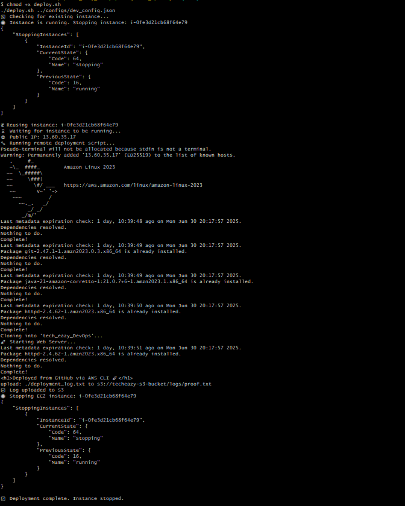

#  TechEazy DevOps Internship Assignments

This repository contains **automated DevOps workflows** using AWS services (EC2, S3, IAM) built as part of the **TechEazy Consulting Internship**.

---

##  Project Structure

```
techeazy_DevOps/
├── README.md
├── run.sh
├── scripts/
│   ├── deploy.sh
│   ├── shutdown_upload.sh
├── configs/
│   ├── dev_config.json
│   ├── s3_config.json
├── iam/
│   ├── create_roles.sh
│   ├── s3_read_policy.json
│   └── s3_upload_policy.json
├── resources/
│   ├── ec2-stopped.png
│   ├── web-output.png
│   └── s3-logs-proof.png
```

---

#  Assignment 1 – EC2 Auto Deployment

###  Objective:

Deploy a basic Apache web server using Bash and AWS CLI on an EC2 instance.

###  Key Actions:

* Reuse or launch EC2 instance
* Install Apache server (httpd)
* Serve HTML from GitHub
* Auto stop the EC2 instance

  ##  Execution Flow

1. `deploy.sh` runs via Bash from local system
2. Checks if a stopped EC2 instance exists

   * If **yes**, it starts and reuses it
   * If **no**, it launches a new one
3. SSH into EC2, installs Apache & deploys HTML message
4. Shuts down the EC2 instance automatically

---

##  How to Run

Make sure:

* AWS CLI is configured (`aws configure`)
* Your `.pem` key is in `~/.ssh/`

```bash
cd scripts
chmod +x deploy.sh
./deploy.sh ./configs/dev_config.json
```


🗁 Proof in `resources/`:

####  EC2 Instance Stopped


####  Apache Server Output


---

#  Assignment 2 – IAM Role + S3 Automation

###  Objective:

Enhance previous task by uploading deployment logs to an S3 bucket using IAM roles.

###  Steps:

#### 1️ Create IAM Roles

```bash
cd iam
chmod +x create_roles.sh
./create_roles.sh
```

Manually attach IAM Role:
Go to **EC2 → Actions → Security → Modify IAM Role → EC2S3UploadProfile**

#### 2️ Deploy & Upload Logs

##  Step-by-step Execution

###  1. IAM Role and Policy Setup

```bash
cd iam
chmod +x create_roles.sh
./create_roles.sh
```

> This script will create:
>
> * IAM Role: `S3UploadRole`
> * Instance Profile: `EC2S3UploadProfile`
> * Attach policy from `s3_upload_policy.json`

After this, manually attach `EC2S3UploadProfile` to your EC2 instance using AWS Console:

> EC2 → Actions → Security → Modify IAM Role → Select `EC2S3UploadProfile`

---

###  2. Launch and Deploy EC2

```bash
cd scripts
chmod +x deploy.sh
./deploy.sh ./configs/dev_config.json
```

> This script will:
>
> * Reuse stopped EC2 or launch new instance
> * SSH into EC2, install dependencies
> * Clone GitHub repo
> * Run `run.sh`
> * Stop the instance automatically

---

###  3. run.sh Responsibilities

* Starts Apache HTTPD server
* Creates `deployment_log.txt`
* Uploads log to bucket from `s3_config.json`
* Outputs success message

---

 `resources/` folder:

####  S3 Log Upload Proof


---

##  Notes

* S3 bucket must be created **before** running `run.sh`
* IAM role must have `s3:PutObject`, `s3:ListBucket` permissions
* Use `jq` in your shell environment

---

##  Submission Checklist

* [x] `README.md` explains all steps clearly
* [x] All scripts are executable (`chmod +x`)
* [x] EC2 automatically stops after job
* [x] Deployment log uploaded to correct bucket
* [x] Folder structure follows assignment format

---

##  Example Run

```bash
./scripts/deploy.sh ./configs/dev_config.json
```

##  Tested On

* Amazon Linux 2023 AMI
* Git Bash on Windows
* AWS CLI v2
* EC2 (t3.micro, Free Tier)

---

##  Sample Configs

### `configs/dev_config.json`

```json
{
  "instance_type": "t3.micro",
  "region": "eu-north-1",
  "ami_id": "ami-xxxxxxxxxxxxxxx",
  "key_name": "techeazy-key",
  "repo_url": "https://github.com/sarc-nitish/tech_eazy_DevOps.git"
}
```


##  Final Notes

 Both assignments completed and tested.
 Auto-stop and cost-saving handled
 Log successfully pushed to S3
 Follows single-folder structure as per mentor’s guidance

---
