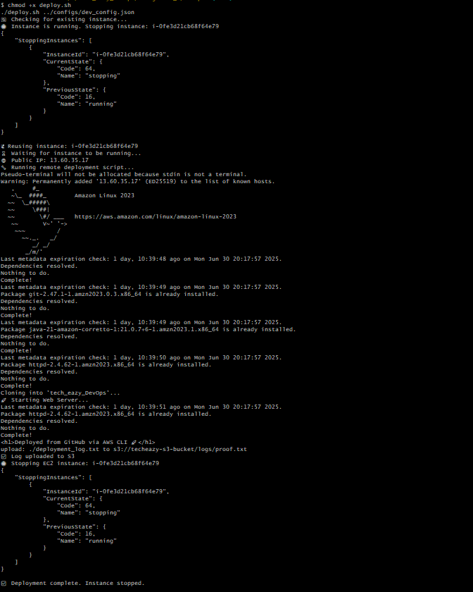
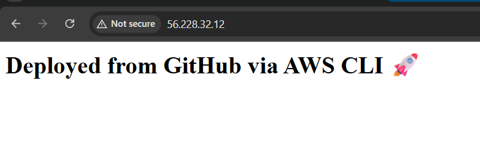
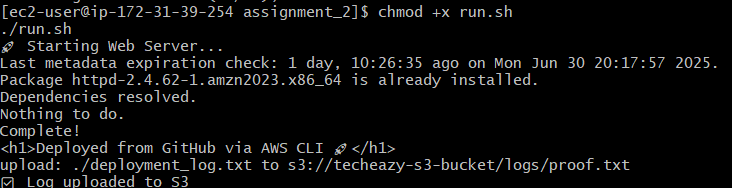

# Assignment 2: EC2 + S3 Automation via AWS CLI

##  Objective:

Automate the following tasks :

* Launch EC2 instance using AWS CLI
* Attach IAM role to allow EC2 to upload logs to S3
* Deploy a simple HTTP server on EC2
* Upload deployment log to a private S3 bucket
* Auto-stop the EC2 instance after task is complete

---

##  Project Structure

```
tech_eazy_DevOps/
├── assignment_2/
│   ├── README.md
│   ├── run.sh
│   ├── configs/
│   │   ├── dev_config.json
│   │   └── s3_config.json
│   ├── iam/
│   │   ├── create_roles.sh
│   │   ├── s3_read_policy.json
│   │   └── s3_upload_policy.json
│   ├── scripts/
│   │   ├── deploy.sh
│   │   └── shutdown_upload.sh (optional)
│   └── resources/
│       ├── ec2-stopped.png
│       ├── web-output.png
│       └── s3-logs-proof.png
```

---

##  Step-by-step Execution

###  1. IAM Role and Policy Setup

```bash
cd iam
chmod +x create_roles.sh
./create_roles.sh
```

> This script will create:
>
> * IAM Role: `S3UploadRole`
> * Instance Profile: `EC2S3UploadProfile`
> * Attach policy from `s3_upload_policy.json`

After this, manually attach `EC2S3UploadProfile` to your EC2 instance using AWS Console:

> EC2 → Actions → Security → Modify IAM Role → Select `EC2S3UploadProfile`

---

###  2. Launch and Deploy EC2

```bash
cd scripts
chmod +x deploy.sh
./deploy.sh ../configs/dev_config.json
```

> This script will:
>
> * Reuse stopped EC2 or launch new instance
> * SSH into EC2, install dependencies
> * Clone GitHub repo
> * Run `run.sh`
> * Stop the instance automatically

---

###  3. run.sh Responsibilities

* Starts Apache HTTPD server
* Creates `deployment_log.txt`
* Uploads log to bucket from `s3_config.json`
* Outputs success message

---

###  Screenshots

####  EC2 Instance Stopped


####  Apache Server Output


####  S3 Log Upload Proof


---

##  Notes

* S3 bucket must be created **before** running `run.sh`
* IAM role must have `s3:PutObject`, `s3:ListBucket` permissions
* Use `jq` in your shell environment

---

##  Submission Checklist

* [x] `README.md` explains all steps clearly
* [x] All scripts are executable (`chmod +x`)
* [x] EC2 automatically stops after job
* [x] Deployment log uploaded to correct bucket
* [x] Folder structure follows assignment format

---

##  Example Run

```bash
./scripts/deploy.sh ./configs/dev_config.json
```

---

Thanks 
✅ Second Assignment Setup Completed
